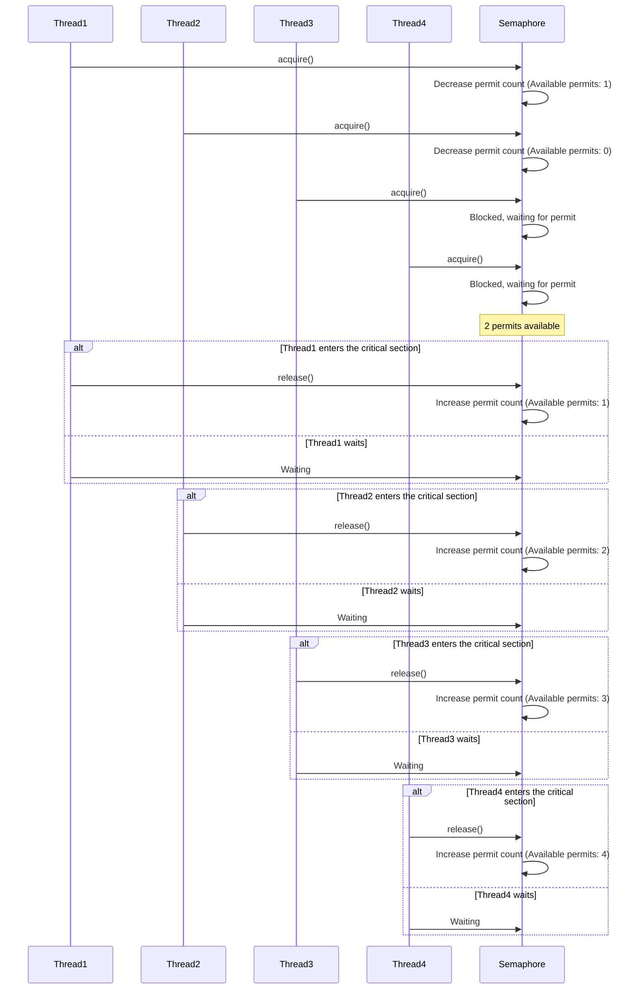
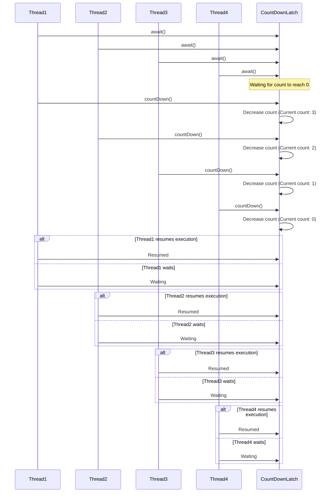
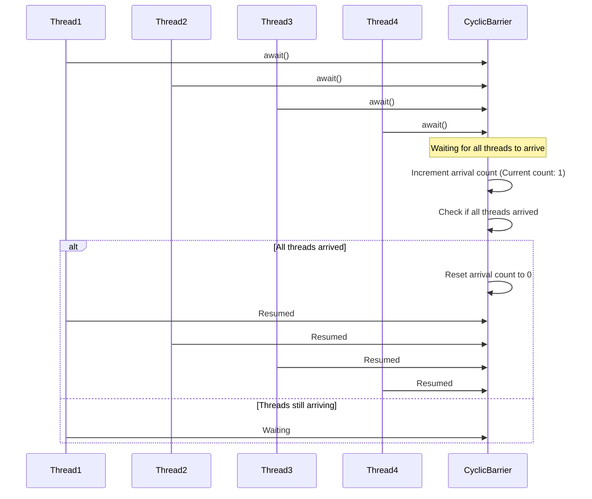
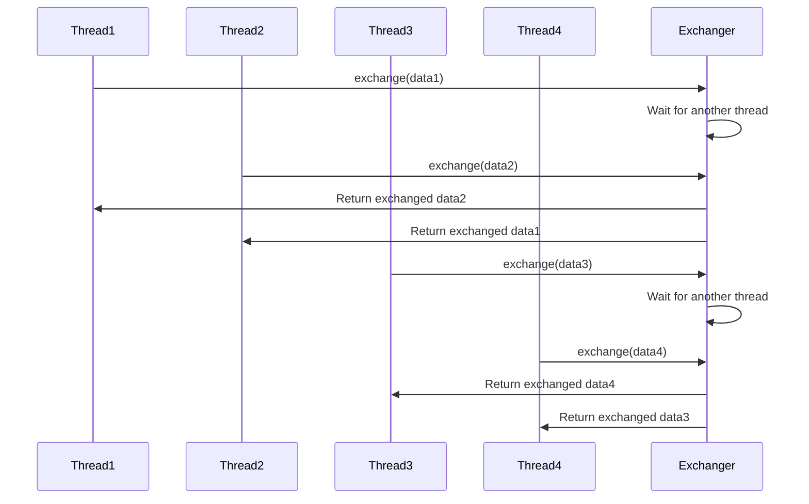
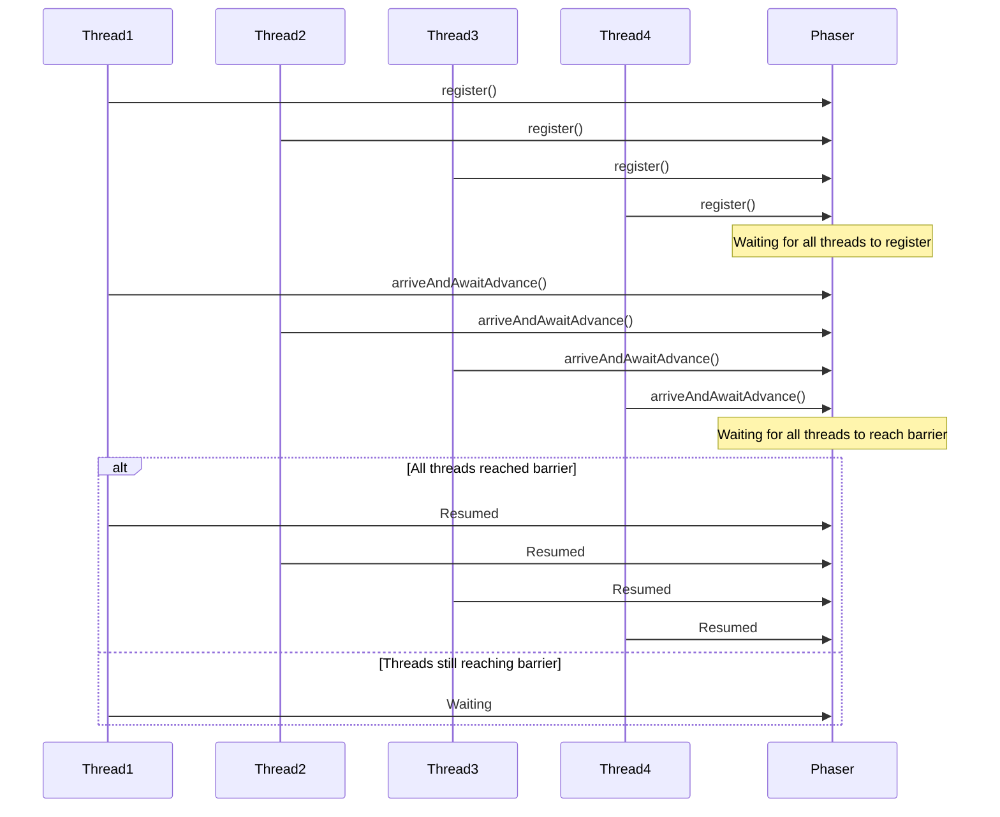

# The Java Synchronizers

## Semaphore

```mermaid
sequenceDiagram
    participant Thread1
    participant Thread2
    participant Thread3
    participant Thread4
    participant Semaphore

    Thread1->>Semaphore: acquire()
    Semaphore->>Semaphore: Decrease permit count (Available permits: 1)
    Thread2->>Semaphore: acquire()
    Semaphore->>Semaphore: Decrease permit count (Available permits: 0)
    Thread3->>Semaphore: acquire()
    Semaphore->>Semaphore: Blocked, waiting for permit
    Thread4->>Semaphore: acquire()
    Semaphore->>Semaphore: Blocked, waiting for permit

    Note over Semaphore: 2 permits available

    alt Thread1 enters the critical section
        Thread1->>Semaphore: release()
        Semaphore->>Semaphore: Increase permit count (Available permits: 1)
    else Thread1 waits
        Thread1->>Semaphore: Waiting
    end

    alt Thread2 enters the critical section
        Thread2->>Semaphore: release()
        Semaphore->>Semaphore: Increase permit count (Available permits: 2)
    else Thread2 waits
        Thread2->>Semaphore: Waiting
    end

    alt Thread3 enters the critical section
        Thread3->>Semaphore: release()
        Semaphore->>Semaphore: Increase permit count (Available permits: 3)
    else Thread3 waits
        Thread3->>Semaphore: Waiting
    end

    alt Thread4 enters the critical section
        Thread4->>Semaphore: release()
        Semaphore->>Semaphore: Increase permit count (Available permits: 4)
    else Thread4 waits
        Thread4->>Semaphore: Waiting
    end

```
---
## CountDownLatch

```mermaid
sequenceDiagram
    participant Thread1
    participant Thread2
    participant Thread3
    participant Thread4
    participant CountDownLatch

    Thread1->>CountDownLatch: await()
    Thread2->>CountDownLatch: await()
    Thread3->>CountDownLatch: await()
    Thread4->>CountDownLatch: await()

    Note over CountDownLatch: Waiting for count to reach 0

    Thread1->>CountDownLatch: countDown()
    CountDownLatch->>CountDownLatch: Decrease count (Current count: 3)
    Thread2->>CountDownLatch: countDown()
    CountDownLatch->>CountDownLatch: Decrease count (Current count: 2)
    Thread3->>CountDownLatch: countDown()
    CountDownLatch->>CountDownLatch: Decrease count (Current count: 1)
    Thread4->>CountDownLatch: countDown()
    CountDownLatch->>CountDownLatch: Decrease count (Current count: 0)

    alt Thread1 resumes execution
        Thread1->>CountDownLatch: Resumed
    else Thread1 waits
        Thread1->>CountDownLatch: Waiting
    end

    alt Thread2 resumes execution
        Thread2->>CountDownLatch: Resumed
    else Thread2 waits
        Thread2->>CountDownLatch: Waiting
    end

    alt Thread3 resumes execution
        Thread3->>CountDownLatch: Resumed
    else Thread3 waits
        Thread3->>CountDownLatch: Waiting
    end

    alt Thread4 resumes execution
        Thread4->>CountDownLatch: Resumed
    else Thread4 waits
        Thread4->>CountDownLatch: Waiting
    end

```
---
## CyclicBarrier

```mermaid
sequenceDiagram
    participant Thread1
    participant Thread2
    participant Thread3
    participant Thread4
    participant CyclicBarrier

    Thread1->>CyclicBarrier: await()
    Thread2->>CyclicBarrier: await()
    Thread3->>CyclicBarrier: await()
    Thread4->>CyclicBarrier: await()

    Note over CyclicBarrier: Waiting for all threads to arrive

    CyclicBarrier->>CyclicBarrier: Increment arrival count (Current count: 1)
    CyclicBarrier->>CyclicBarrier: Check if all threads arrived

    alt All threads arrived
        CyclicBarrier->>CyclicBarrier: Reset arrival count to 0
        Thread1->>CyclicBarrier: Resumed
        Thread2->>CyclicBarrier: Resumed
        Thread3->>CyclicBarrier: Resumed
        Thread4->>CyclicBarrier: Resumed
    else Threads still arriving
        Thread1->>CyclicBarrier: Waiting
    end

```
---
## Exchanger

```mermaid
sequenceDiagram
    participant Thread1
    participant Thread2
    participant Thread3
    participant Thread4
    participant Exchanger

    Thread1->>Exchanger: exchange(data1)
    Exchanger->>Exchanger: Wait for another thread
    Thread2->>Exchanger: exchange(data2)
    Exchanger->>Thread1: Return exchanged data2
    Exchanger->>Thread2: Return exchanged data1
    Thread3->>Exchanger: exchange(data3)
    Exchanger->>Exchanger: Wait for another thread
    Thread4->>Exchanger: exchange(data4)
    Exchanger->>Thread3: Return exchanged data4
    Exchanger->>Thread4: Return exchanged data3
    
```
---
## Phaser

```mermaid
sequenceDiagram
    participant Thread1
    participant Thread2
    participant Thread3
    participant Thread4
    participant Phaser

    Thread1->>Phaser: register()
    Thread2->>Phaser: register()
    Thread3->>Phaser: register()
    Thread4->>Phaser: register()

    Note over Phaser: Waiting for all threads to register

    Thread1->>Phaser: arriveAndAwaitAdvance()
    Thread2->>Phaser: arriveAndAwaitAdvance()
    Thread3->>Phaser: arriveAndAwaitAdvance()
    Thread4->>Phaser: arriveAndAwaitAdvance()

    Note over Phaser: Waiting for all threads to reach barrier

    alt All threads reached barrier
        Thread1->>Phaser: Resumed
        Thread2->>Phaser: Resumed
        Thread3->>Phaser: Resumed
        Thread4->>Phaser: Resumed
    else Threads still reaching barrier
        Thread1->>Phaser: Waiting
    end

```