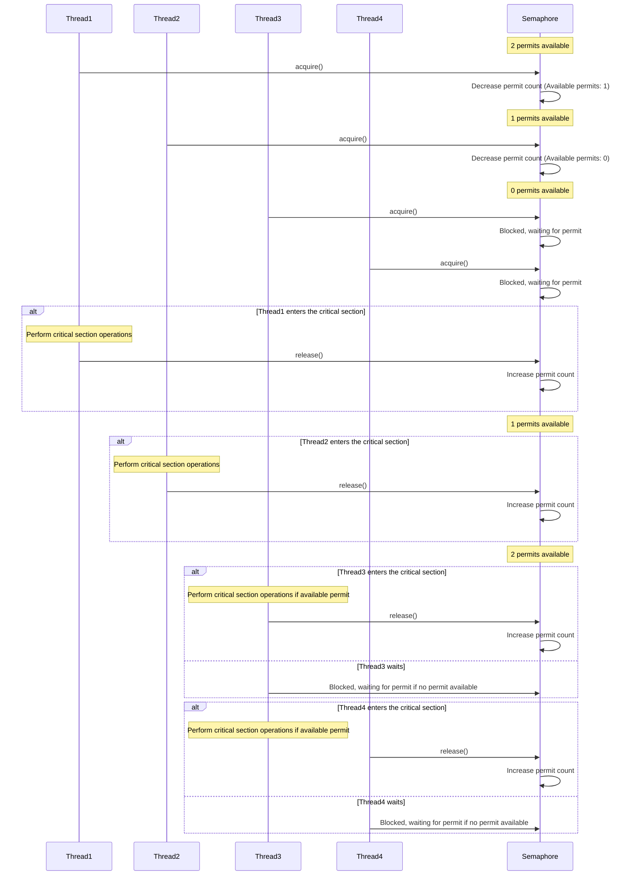
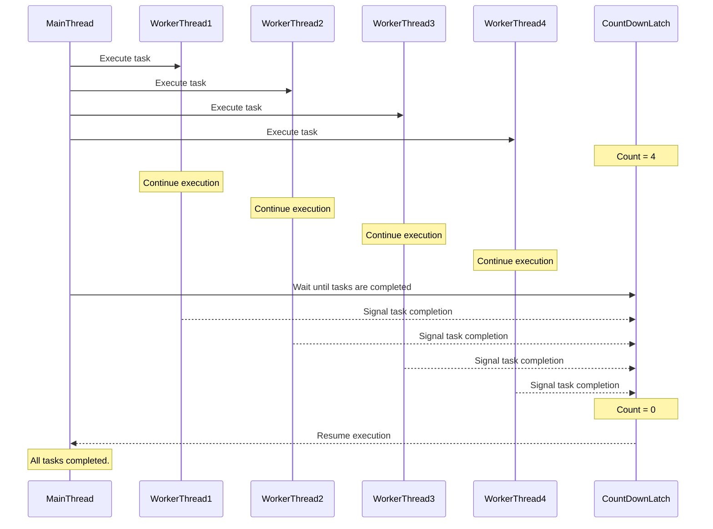
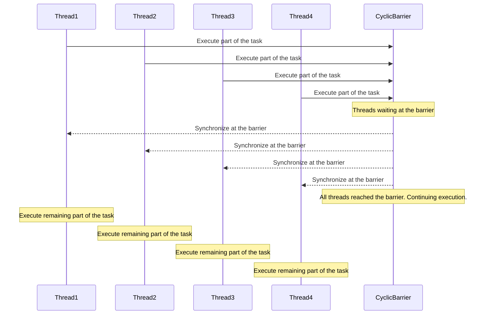
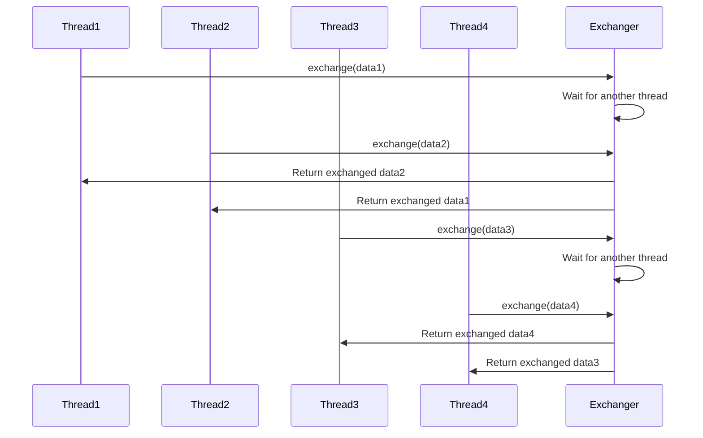
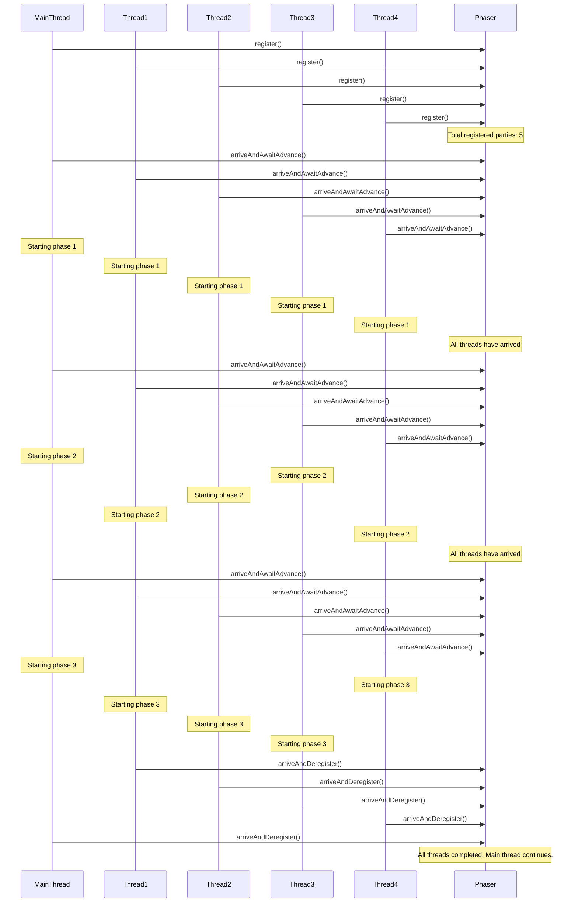

# The Java Synchronizers

## Semaphore
- **Purpose**: Semaphore is used to control access to a shared resource by **limiting the number of threads** that can access it simultaneously.
- **Usage**: It is commonly used in scenarios where you want to **limit concurrent access to a resource** or **protect a critical section** of code.
- **Metaphor**: Think of a nightclub with a limited capacity. The bouncer at the entrance allows a certain number of people to enter at a time. Once the limit is reached, additional people have to wait until others exit.

---
## CountDownLatch
- **Purpose**: CountDownLatch is used to synchronize multiple threads by **waiting for a fixed number of events or tasks** to complete before proceeding.
- **Usage**: It is commonly used when you have a main thread that needs to **wait for several worker threads** to finish their tasks before continuing.
- **Metaphor**: Imagine a relay race with multiple runners. The anchor leg runner waits at the finish line, and the race can only be considered complete when all runners have crossed the finish line and the anchor leg runner receives the baton.

---
## CyclicBarrier
- **Purpose**: CyclicBarrier is used to synchronize a fixed number of threads at a common barrier point, where they must **wait until all threads have arrived** before proceeding together.
- **Usage**: It is commonly used in scenarios where you have **multiple threads performing different parts of a task**, and you want them to **wait for each other** at certain synchronization points.
- **Metaphor**: Picture a team building activity where team members are spread across an obstacle course. They can only move to the next obstacle when all team members have completed the current one. They repeat this cycle until they reach the final obstacle together.

---
## Exchanger
- **Purpose**: Exchanger provides a synchronization point where **two threads can exchange data**, allowing them to **coordinate and communicate** with each other.
- **Usage**: It is commonly used in scenarios where two threads need to **exchange information or pass data** between each other.
- **Metaphor**: Think of a secret message exchange between two agents. They meet at a predetermined location, exchange their information, and then go their separate ways.

---
## Phaser
- **Purpose**: Phaser is a more flexible synchronization construct that allows synchronization of a **variable number of threads in multiple phases**, providing a more dynamic synchronization mechanism.
- **Usage**: It is commonly used in scenarios where the **number of participating threads can change dynamically**, and synchronization needs to be performed in **multiple stages or phases**.
- **Metaphor**: Imagine a music concert with multiple performances and intermissions. The audience waits for each phase of the concert to complete before moving on to the next, allowing for variations in the number of performers and acts.

